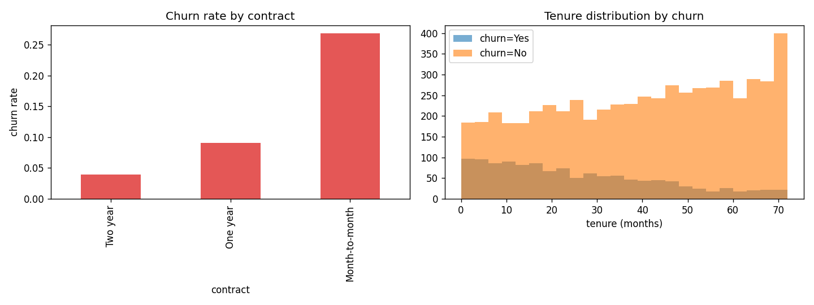
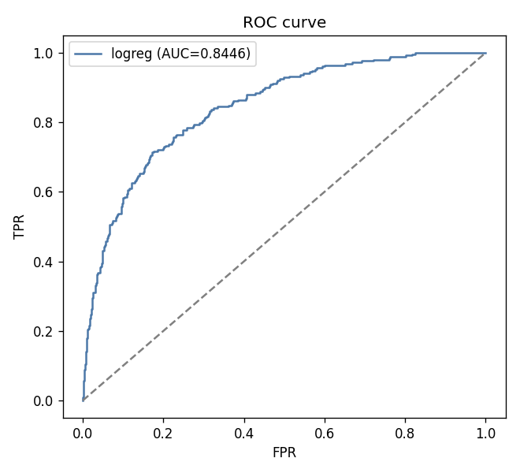
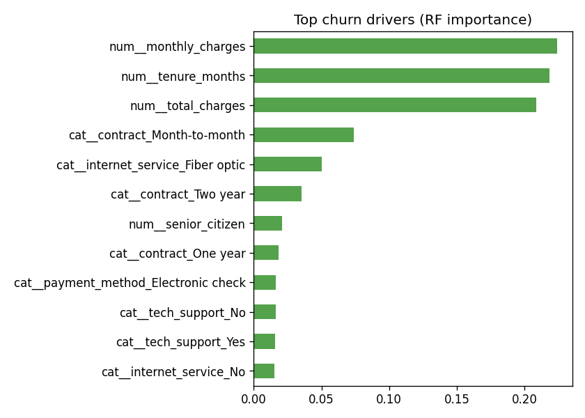

# 📊 Customer Churn Analysis

> An end-to-end data-science study: **which customers churn, why, and what to do about it** — with EDA, an interpretable model (ROC-AUC ≈ 0.84), and business recommendations.

<p align="left">
  
  
  
  
  
  
</p>

---

## 📌 Problem

Retaining a customer is far cheaper than acquiring a new one. This project analyzes a Telco-style customer base (7,000 customers, ~18% churn) to (1) understand the drivers of churn and (2) build a model that scores customers by churn risk so retention spend can be targeted.

## 🔎 Key findings

| Insight | Evidence |
|---|---|
| **Contract type is the #1 lever** | Month-to-month customers churn several times more than two-year contracts. |
| **Early tenure is the danger zone** | Churn concentrates in the first months; long-tenure customers rarely leave. |
| **Fiber + no tech support = high risk** | Premium service without support raises dissatisfaction. |
| **Price sensitivity** | Higher monthly charges correlate with higher churn. |

The model recovered exactly these drivers as its top features — confirming the signal is real and explainable.

## 📈 Visuals

| EDA overview | ROC curve | Churn drivers |
|---|---|---|
|  |  |  |

## 🧪 Approach

1. **Data understanding** — shape, dtypes, missingness, target balance.
2. **EDA** — churn rates across contract, internet service, tenure, payment method.
3. **Feature engineering** — scaling numerics, one-hot encoding categoricals inside a `ColumnTransformer`.
4. **Modeling** — Logistic Regression vs Random Forest in a `Pipeline`, with class weighting for imbalance.
5. **Evaluation** — ROC-AUC, ROC curve, classification report, feature importance.
6. **Recommendations** — translate the model into retention actions.

> **Result:** Logistic Regression reaches **ROC-AUC ≈ 0.84** while remaining fully interpretable — a strong, deployable baseline for a churn-scoring system.

## ⚡ Reproduce

```bash
git clone https://github.com/harshalingawale/customer-churn-analysis.git
cd customer-churn-analysis
python -m venv venv && source venv/bin/activate
pip install -r requirements.txt

python data/generate.py        # build the dataset
python -m src.churn_model      # EDA + modeling -> reports/figures + metrics.json
jupyter notebook notebooks/churn_analysis.ipynb   # the narrative walkthrough
```

## 🗂️ Structure

```
customer-churn-analysis/
├── data/generate.py            # synthetic Telco-style churn dataset
├── notebooks/churn_analysis.ipynb   # executed narrative (EDA → model → findings)
├── src/churn_model.py          # reproducible script: figures + metrics.json
└── reports/
    ├── figures/                # eda_overview, roc_curve, feature_importance
    └── metrics.json
```

## 🛠️ Tech Stack

**Python · pandas · NumPy · scikit-learn · matplotlib · Jupyter**

## 📝 License

MIT © [Harshal Ingawale](https://github.com/harshalingawale)

---

> *Dataset is synthetically generated with realistic, interpretable churn drivers — no personal or proprietary data is used.*
